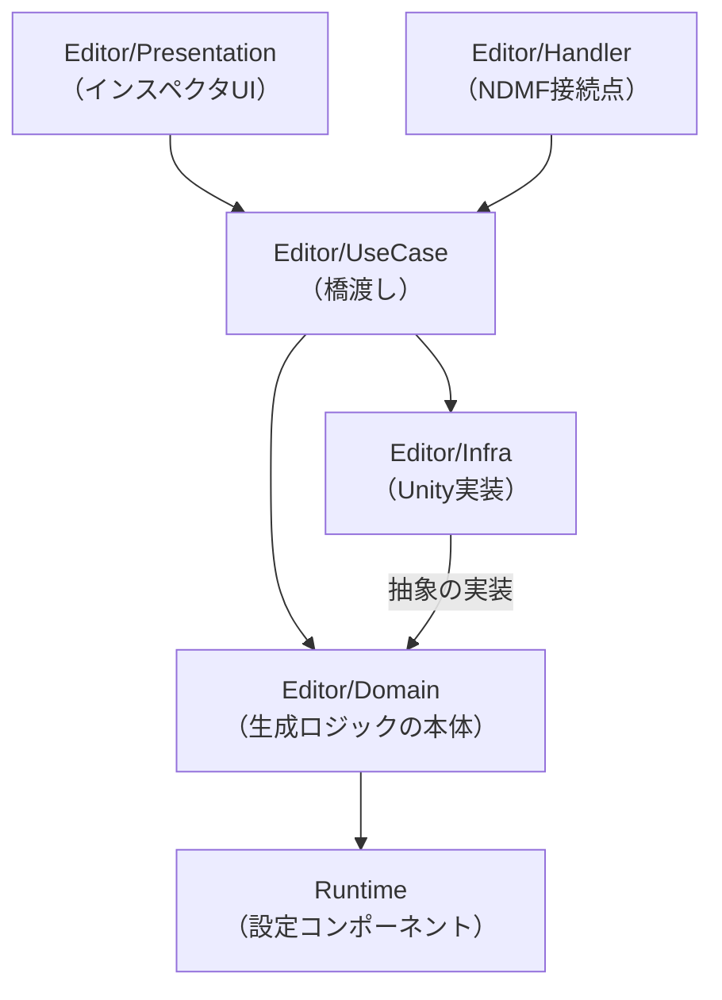

# コードリーディングガイド

このリポジトリを初めて読む人向けに、全体の構造と読み始めの入口をまとめる。
機能の使い方とテストの実行手順は `README.md` にあるため、ここでは構造と処理の流れを扱う。

## このパッケージがやること

VRChatアバターの既存シェイプキー（まばたき、あ、い、う など）から、フェイストラッキングに使うARKit用BlendShapeを生成する[NDMF](https://ndmf.nadena.dev/)プラグインである。
生成が走る経路は2つある。
本番はアバターのビルド時（アップロード時）で、メッシュの複製へBlendShapeを書き込んでレンダラーを差し替える。
もう1つはNDMFプレビューで、シーン上のプロキシメッシュへ同じ生成を行い、結果を事前確認できるようにする。
どちらの経路も同じ生成ロジックを通る。

## レイヤ構成

ディレクトリがそのままレイヤに対応する。

- **`Runtime/`**：設定値を保持するコンポーネント（`ARKitBlendShapeGeneratorComponent`）と、生成対象レンダラーの解決（`TargetRendererResolver`）。
  コンポーネントはビルド中に取り除かれるため、アバターの実行時には何も残らない
- **`Editor/Handler/`**：NDMFとの接続点。
  ビルドのエントリポイント、プレビュー、重複コンポーネントの自動排除
- **`Editor/UseCase/`**：入口とドメインの橋渡し。
  処理対象の選定と、Infra実装の組み立て
- **`Editor/Domain/`**：生成ロジックの本体。
  メッシュの読み書きは `IMeshRepository` 越しに行い、`UnityEngine.Mesh` へ直接依存しない
- **`Editor/Infra/`**：Domainが定義した抽象のUnity実装（`UnityMeshRepository` など）と、エディタAPIへ触る部品。
  更新確認の通信とEditorPrefsの読み書き（`UpdateCheck`）、インストール形態の問い合わせ（`PackageLocation`）もここに置く
- **`Editor/Presentation/`**：インスペクタUI
- **`Editor/Localization/`**：NDMFのローカライズ機構を使った文言管理（日英の `.po`）
- **`Tests/Editor/`**：EditModeテスト

依存の向きは、外側（Handler、Presentation）からUseCaseを経てDomainへ向かい、InfraはDomainの抽象を実装して外側から注入される。

矢印は参照の向き（参照する側 → される側）を表す。
図には生成処理の主要な依存だけを載せており、外側のレイヤが図で下にあるレイヤを直接参照する箇所もある。
たとえばHandlerのプレビューはDomainの `CustomMappingValidation` や `PreviewSettingsSnapshot` とInfraの共有状態を、Presentationは自動マッピング一覧のためにDomainの `ARKitMappingTable` と `AutoMappingSummary` を直接使う。
向きが内側（図の下方向）へ揃っていることが約束事で、DomainやRuntimeが外側のレイヤを参照することはない。
`Editor/Localization/` は、HandlerやUseCase、Domain、Presentationといった複数のレイヤから文言参照のために使われるため、図からは省いた。

Domainを `UnityEngine.Mesh` から切り離しているのは、生成ロジックのテストをUnityのメッシュなしで回すためである。
テストでは `Tests/Editor/FakeMeshRepository.cs` のインメモリ実装へ差し替える。

## 処理の流れ

### ビルド時

エントリポイントは `Editor/Handler/ARKitBlendShapeGeneratorPlugin.cs` である。
NDMFのGenerating Phaseで、Jerry's Templatesより先に実行されるよう登録している。

1. アバター内のコンポーネントを収集し、`GenerateBlendShapesUseCase.SelectPrimaryComponent` で1つに絞る（アバタールート直付けを優先）
2. `GenerateBlendShapesUseCase.ExecuteForBuild` が、カスタムマッピングの重複検証、対象レンダラーの解決、メッシュの複製を行い、複製へ生成してからレンダラーへ差し替える
3. コンポーネントは生成の成否にかかわらず削除する（ビルド終盤の最適化ツールに未知のコンポーネントとして検出されないようにするため）

### 生成エンジン

生成の本体は `Editor/Domain/BlendShapeGenerationEngine.cs` の `Generate` である。
ファイルは約1500行あるが、`Generate` メソッド自体は骨格だけなので、まずそこを読めば全体の順序がつかめる。

1. カスタムマッピングを収集する（`CollectCustomMappings`）。
   自動マッピングより優先され、ソースを持つ有効な定義のARKit名は自動側の対象から外れる
2. 自動マッピングを収集する（`CollectAutoMappings`）。
   `ARKitMappingTable` が持つVRChat/MMD名との照合で決まる
3. 口の打ち消しデルタを組み立てる（`BuildMouthCancellationDelta`）
4. 書き込み計画を立てる（上書き対象は元の位置への置き換え、それ以外は末尾への追加）
5. 手続き的な口の生成を計画へ加える（`CollectProceduralMouthShapes`）。
   シェイプキーから生成できなかったものへのフォールバックで、変形の実体は `ProceduralMouthShapeGenerator` にある。
   ただしソースを持つ有効なカスタムマッピングのARKit名は、その生成が失敗していてもユーザー設定を尊重して対象外になる
6. まとめて書き込む（`WriteBlendShapes`）

生成する各BlendShapeのデルタ（頂点ごとの変位）は計画の段階では作らず、書き込む直前に1件ずつ実体化する。
生成シェイプ数×頂点数分のメモリを一度に抱えないための構造で、こうした設計の理由はコード中のコメントが説明している。
例外は口の打ち消し用デルタで、複数のシェイプへ焼き込む共有データのため、計画より前に組み立てて書き込みが終わるまで保持する。
また、対象メッシュ自身がソースを兼ねたまま上書きする場合も、再構築でソースのデルタを読み直せなくなるため全件を先に実体化する（複製を渡す通常のUseCase経路では通らず、`Generate` を直接呼ぶときだけ成立する）。

### プレビュー時

`Editor/Handler/ARKitBlendShapeGeneratorPreview.cs` が、NDMFの `IRenderFilter` としてプレビューを実装する。
プロキシメッシュの複製へ、ビルドと同じ `GenerateBlendShapesUseCase.GenerateInto` で生成する。

このファイルの大半は「いつ再生成するか」の制御である。
設定変更は `PreviewSettingsSnapshot` が差分の種類（構造的変更か、スライダーのような連続変更か）へ分類する。
連続変更は毎フレーム届くため、`PreviewRebuildDebouncer`（実行時刻の計算）と `PreviewRebuildScheduler`（エディタ更新との接続）が再生成を先送りする。
先送りは2つの時刻で制御され、要求が止んでから `IdleDelaySeconds`（0.1秒）経てば実行し、要求が続いていても最初の要求から `MaxDeferSeconds`（0.4秒）で打ち切って実行する。
値が落ち着くまで無限に待つのではなく、長いドラッグの間もプレビューを一定間隔で追従させるための上限である。

### インスペクタ

`Editor/Presentation/ARKitBlendShapeGeneratorEditor.cs` がカスタムエディタである。
設定UIのほか、自動マッピング一覧の表示（`AutoMappingSummary` がマッピング定義から組み立てる）と、生成シェイプをスライダーで動かすプレビュー再生を持つ。
プレビュー再生は `ARKitBlendShapeGeneratorPreviewState`（`PublishedValue` によるエディタ全体の共有状態）へウェイトを書き、プレビューノードが毎フレームそれをプロキシへ適用する。

### 更新の確認

インスペクタの先頭に、新しいバージョンが出ているかの案内を出す。
GitHubのreleasesへ問い合わせるのは `UpdateCheck` で、確認するかどうかを利用者が選ぶまでは通信しない。
確認する場合も1日1回までとし、失敗しても黙って次の機会へ回す。

案内の文面はインストール形態で変わる。
形態の判別は `PackageLocation` がasmdefの位置をUnityへ問い合わせ、そのパスの解釈を `PackageInstallation` が行う。
`Packages/` 配下ならVPM版、`Assets/` 配下ならbooth版とみなす。
booth版は利用者がフォルダを移動できるため、固定のパスではなくasmdefの位置を起点にする（`Localization` の翻訳ファイル探索と同じ考え方）。

VPM版でファイルを置き換えないのは、版数をVCC/ALCOMが `vpm-manifest.json` で管理しているためである。
こちらが中身だけ差し替えると、管理側の記録と実態がずれる。

## どこから読み始めるか

次の順で読むと迷いにくい。

1. `README.md`：機能と設定項目を把握する。
   生成ロジックの分岐は機能仕様の反映なので、先に仕様を知らないと分岐の意図が読めない
2. `Runtime/ARKitBlendShapeGeneratorComponent.cs`：設定項目の一覧。
   ユーザーが調整できる設定はすべてここにあり、メッシュや自動マッピング定義といった残りの入力はUseCaseが組み立ててエンジンへ渡す
3. `Editor/Handler/ARKitBlendShapeGeneratorPlugin.cs` と `Editor/UseCase/GenerateBlendShapesUseCase.cs`：入口から生成までの道筋
4. `Editor/Domain/BlendShapeGenerationEngine.cs` の `Generate`：生成の骨格。
   個々のステップの詳細は、必要になったときに対応するprivateメソッドへ降りる

その先は目的で分かれる。
マッピングの対応関係を知りたければ `ARKitMappingTable`、プレビューの再生成制御なら `ARKitBlendShapeGeneratorPreview` と `PreviewRebuildDebouncer`、UIなら `ARKitBlendShapeGeneratorEditor` を読む。

テストから入る手もある。
`Tests/Editor/` の各テストは機能ごとの仕様の固定化を兼ねている。
生成エンジンを扱うテストは `FakeMeshRepository` を使っていて、Unityのメッシュなしで生成ロジックが動く様子をそのまま追える。

## 読むときに知っておくと迷わないこと

- **対象レンダラーの解決**：`TargetRendererResolver` が唯一の解決ロジックで、ビルド、プレビュー、インスペクタ表示、Reset時の自動設定がすべてここを通る。
  経路ごとに探索順序が食い違うと、プレビューとビルドで別のメッシュを対象にしてしまうため
- **カスタムマッピングの重複検証**：生成を中止する検証は、ビルド入口、プレビュー、生成エンジン内の3か所で行う。
  エンジンは呼び出し元の検証を前提にせず、自身でも確認する。
  このほかインスペクタも、編集中に同じ判定（`CustomMappingValidation`）でエラーを表示する
- **重複コンポーネントの排除**：`DisallowMultipleComponent` は同一GameObject内しか防げないため、アバター単位の一意性は `DuplicateComponentGuard` が `OnValidate` フック経由で担保する。
  ビルド時にも `SelectPrimaryComponent` で1つに絞る
- **更新確認の外部通信**：Editorから外部へ出る通信はここだけで、利用者が確認を選ぶまでは行わない。
  選択は `EditorPrefs` に持ち、インスペクタの問いかけと Preferences > ARKit BlendShape Generator のどちらからも変えられる
- **文言**：Editor側でユーザーへ見せる文字列は直接書かず、`Localization.S(キー)` で引く。
  文言の実体は `Editor/Localization/*.po` にある。
  例外はRuntimeコンポーネントの `[Header]` と `[Tooltip]` で、Editorアセンブリにある `Localization` をRuntime側からは参照できないため、カスタムエディタが無効なとき用の英語文言を直接持っている
